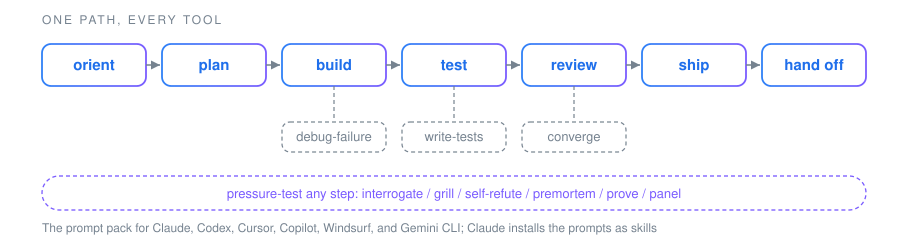

<div align="center">

# Outpost

One prompt pack for six coding agents, with a verify step that catches drift.

[](https://github.com/alawein/outpost/actions/workflows/ci.yml)


</div>

## The claim

Measured by the drift benchmark in `benchmarks/drift/`: <!-- GENERATED:benchmark-headline -->verify caught 30 of 30 seeded drifts across 6 tools; plain git status caught 18 of 30; copying by hand caught 0<!-- /GENERATED:benchmark-headline -->. The last number is a floor, not a run: copying by hand has no source to compare against, so it misses by definition.

In practice: install the pack into a repo, append one line to Cursor's copy of `plan-change` and one line to the `CLAUDE.md` the kit wrote, then verify:

```text
$ python install.py --tool all --project /path/to/your/repo --verify
verify 'all' against /path/to/your/repo (no files written)
  EDITED  CLAUDE.md (yours to keep; differs from what the kit wrote)
  ...
  ok      .claude/skills/plan-change/SKILL.md
  ...
  DRIFTED .cursor/rules/outpost/plan-change.md
  ...
NOTE: 1 guide(s) edited since install; yours to keep, not drift
DRIFT: re-run install to restore the kit files
```

The edited prompt copy is drift and fails the run. The edited guide is yours, so it is reported and the exit code ignores it. Reproduce the benchmark with `python benchmarks/drift/run.py` (git on PATH, under two minutes, writes only to a temp directory); every row, including the ones git misses, is in [benchmarks/drift/README.md](benchmarks/drift/README.md).

<div align="center">



</div>

## Install

Python 3.9 or newer, nothing to pip install.

```bash
git clone https://github.com/alawein/outpost && cd outpost
python install.py --tool claude --project /path/to/your/repo
python install.py --tool claude --project /path/to/your/repo --verify
```

Swap `claude` for `codex`, `cursor`, `copilot`, `windsurf`, `gemini`, or `all`. Narrow the pack with `--only` or `--exclude`, preview with `--dry-run`, clean up after a narrower re-install with `--prune`, and uninstall a tool with `--remove`. The installer never overwrites a file you wrote; the one file it edits in place is `.claude/settings.json`, where it adds deny rules for secrets and leaves your keys alone. Full install walkthrough: [docs/onboarding.md](docs/onboarding.md).

## Use

Ask your agent for the step in front of you. Nine prompts to start with:

```text
orient-repo        # map an unfamiliar repo
plan-change        # scope before editing
implement-change   # small correct edits, runnable tree at each step
write-tests        # cover the behavior, not the implementation
simplify           # clean the change: fold duplication, cut waste
grill              # try to break it before you trust it
repo-review        # audit a whole repo: structure, docs truth, tests, drift
triage             # rank findings: fix now, defer, or reject
prepare-pr         # commit, PR body, pre-merge checks
```

In Claude Code the prompts are skills and load by description. In Windsurf run `/outpost-<name>`; in Gemini CLI run `/outpost:<name>`. In Codex, Cursor, and Copilot point the agent at the matching file. The Claude Code plugin ([docs/plugin.md](docs/plugin.md)) adds nine commands, tabled in [docs/workflow.md](docs/workflow.md), among them `/outpost:drive` to plan, build, and test, and `/outpost:ship` to review and draft the PR (a human opens it). The ordered path and all <!-- GENERATED:core-count-words -->twenty-eight<!-- /GENERATED:core-count-words --> prompts are in [docs/workflow.md](docs/workflow.md).

## Supported tools

| Tool | What gets installed |
|---|---|
| claude | a guide, the prompts as skills that load on their own, and safety rules for secrets only |
| codex | a guide and the prompts as files |
| cursor | a repo rule and the prompts as rules |
| copilot | repo instructions and the prompts as prompt files, for the VS Code, Visual Studio, and JetBrains Copilot integrations |
| windsurf | an always-on rule and the prompts as workflows, invoked as `/outpost-<name>` |
| gemini | `GEMINI.md` and the prompts as custom commands, invoked as `/outpost:<name>` |

Each tool writes to its own paths, so they can live in one project. What differs between the tools and why: [docs/adapters.md](docs/adapters.md).

## Watch a library you do not own

Point the installer at a skill library you cloned (obra/superpowers, or any tree in the Agent Skills layout) and its skills install next to the core prompts, for every tool, checked by the same `--verify`:

```bash
git clone https://github.com/obra/superpowers /path/to/superpowers
python install.py --tool claude --project /path/to/your/repo --source /path/to/superpowers
python install.py --tool claude --project /path/to/your/repo --verify
```

Pull the clone and every installed copy of a skill that changed reads `DRIFTED` until you re-install with `--source`. The kit never fetches. Per-tool paths and the limits (supporting files, cross-references, Windsurf's size cap): [docs/sources.md](docs/sources.md).

## Agent Skills

For Claude Code the prompts install as `SKILL.md` files in the open Agent Skills layout, the same layout `--source` reads; the other five tools get the same text in the format each one reads (a file, a rule, a prompt file, a workflow, a command). The kit compiles into that layout and verifies every copy against one source; it does not compete with the standard.

## Scope

Outpost is for one person or a small team running several coding agents on the same repos. It is not a process plugin: a plugin such as superpowers picks how a task gets done, Outpost picks what runs and proves the copies landed, and a clone of its skill tree installs beside the pack as a source. It is not a sync tool for a rules file you already wrote: the checks cover only what the kit installed. Adoption beyond the maintainer is unproven, and the benchmark measures drift detection, not whether the prompts make an agent better.

## Docs map

- [docs/onboarding.md](docs/onboarding.md)
- [docs/workflow.md](docs/workflow.md)
- [docs/adapters.md](docs/adapters.md)
- [docs/sources.md](docs/sources.md)
- [docs/plugin.md](docs/plugin.md)
- [benchmarks/drift/README.md](benchmarks/drift/README.md)
- [docs/how-this-is-built.md](docs/how-this-is-built.md)
- [docs/writing-standard.md](docs/writing-standard.md)
- [docs/contributing.md](docs/contributing.md)
- [docs/releasing.md](docs/releasing.md)
- [docs/ROADMAP.md](docs/ROADMAP.md)
- [docs/token-budget.md](docs/token-budget.md)
- [docs/labels.md](docs/labels.md)
- [docs/DEBT.md](docs/DEBT.md)
- [docs/decisions/](docs/decisions/README.md)
- [docs/architecture/topology.md](docs/architecture/topology.md)
- [AGENTS.md](AGENTS.md)
- [CLAUDE.md](CLAUDE.md)

`python validate.py` and `pytest` prove the kit's own tree, not a consumer repo. CI runs both plus `python benchmarks/drift/run.py --check` on Linux and Windows.

MIT licensed. See [LICENSE](LICENSE).
