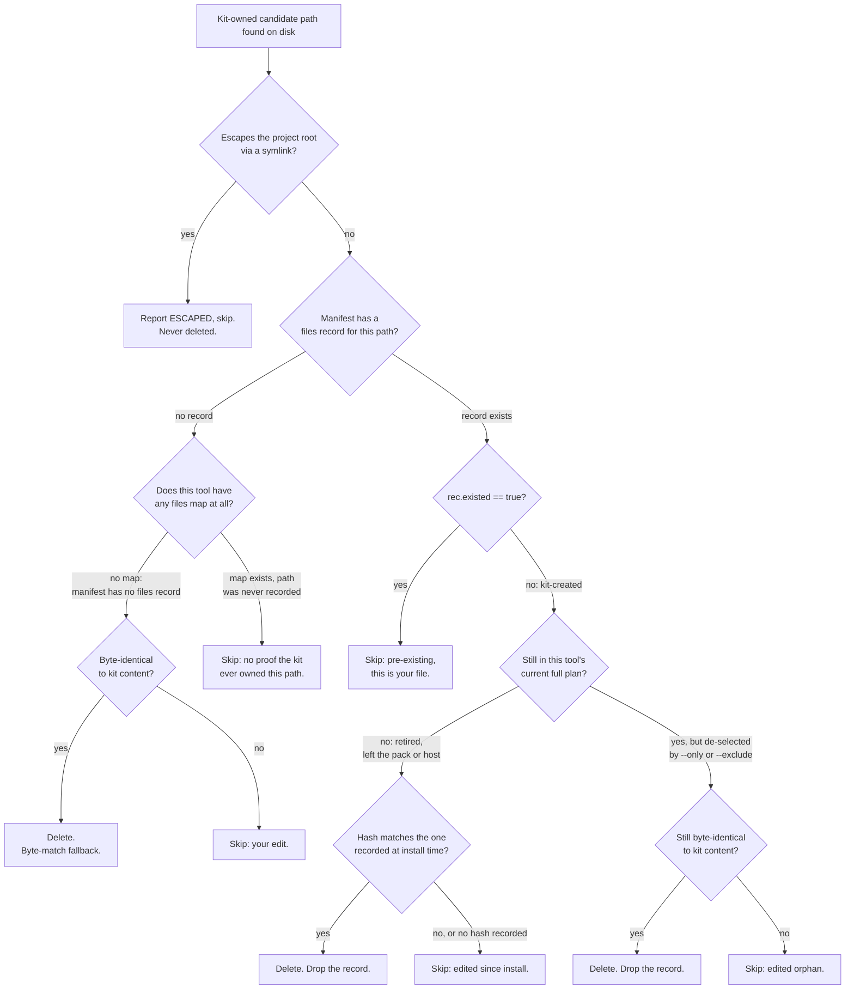

# Adapters

An adapter turns the core prompts in `prompts/core/` into the files one of the six tools expects, and `--verify` reads every installed copy back against that source.

## The model

An adapter is `plan(kit_root, project_root, terse=False, select=None, tolerant=False)` returning a list of Actions. Each Action has a path, content, and mode:

- `write`: a kit-owned path, usually a prompt file. Overwritten with rendered content on every install.
- `create`: a user-owned path (`CLAUDE.md`, `AGENTS.md`, `GEMINI.md`, the Cursor rule, the Copilot instructions, the Windsurf rule). Written only if absent.
- `merge`: a shared config file (`.claude/settings.json`). Content is the merged result.

The installer plans first, then prints (`--dry-run`) or applies. Both use the same path, so the preview is exact.

## What each tool gets

| Tool | User-owned (create) | Kit-owned (write) | Merged |
|---|---|---|---|
| Claude | `CLAUDE.md` | `.claude/skills/<name>/SKILL.md`, optional `.claude/output-styles/terse.md` | `.claude/settings.json` deny rules |
| Codex | `AGENTS.md` | `.agents/prompts/<name>.md` | none |
| Cursor | `.cursor/rules/outpost.mdc` | `.cursor/rules/outpost/<name>.md` | none |
| GitHub Copilot | `.github/copilot-instructions.md` | `.github/prompts/<name>.prompt.md` | none |
| Windsurf | `.windsurf/rules/outpost.md` | `.windsurf/workflows/outpost-<name>.md` | none |
| Gemini CLI | `GEMINI.md` | `.gemini/commands/outpost/<name>.toml` | none |

Paths stay separate across tools, so more than one install in the same repo does not collide. The `adapters` check proves this on every `python validate.py` run.

## Flags

- `--tool <name>|all` chooses the target tool; required for every install, verify, prune, or
  remove, unless `--list` is given instead. `--project <path>` chooses the target project
  directory; defaults to `.`.
- `--only <names>` / `--exclude <names>` narrow the pack to a comma-separated subset (mutually
  exclusive with each other); the full pack installs by default.
- `--dry-run` prints the plan and writes nothing.
- `--terse` also installs, and defaults to, the terse output style (Claude only).
- `--list` prints what the kit would install (prompts, templates, and adapters) and writes
  nothing; it needs no `--tool`/`--project`, since it describes the kit itself, not a target
  install.
- `--verify`, `--prune`, and `--remove` are mutually exclusive with each other and with
  `--list`/`--dry-run`; see their own sections below.
- `--source <dir>` (repeatable) also installs the skills of a library you cloned, in the Agent
  Skills layout, next to the core prompts. It works with `--dry-run`, `--verify`, `--prune`, and
  `--remove` and with `--only`/`--exclude`; `--list` shows the core pack only. See
  `docs/sources.md` for the per-tool paths and the limits.

## The install manifest

Each install writes `.outpost/manifest.json` at the project root. It records the kit version and, per tool, which prompts were installed, how they were chosen (`full`, `only`, or `exclude`), and whether `--terse` was used. `--verify` reads that record and checks the installed subset, not the full pack. That keeps excluded prompts from being reported as missing. It also lets `--verify`/`--prune`/`--remove` handle the terse output style without re-passing `--terse`. Installing a second tool adds its entry without dropping the first.

`--verify` prints one line per file. `ok` is in place (a guide may also be absent, which is fine), `MISSING` is gone, `DRIFTED` no longer matches the kit, `EXTRA` is a leftover from a narrower re-install, `LEFTOVER` is a kit file whose prompt no longer ships to this tool (`--prune` removes both), and `ESCAPED` resolves outside the project via a symlink; any of those but `ok` fails the check. `EDITED` marks a guide (`CLAUDE.md` and the like) the kit wrote that you have since changed. The guide is yours, so `EDITED` is information only and never fails the check.

The installer never deletes during a normal install. If you narrow an install (`--only`/`--exclude` over a broader one), the de-selected prompt files stay on disk. `--verify` reports them as `EXTRA`, and `--prune` removes them. Prune deletes only kit-owned prompt files the manifest no longer selects. It never deletes a user-owned or merged file, and it skips a hand-edited file. The manifest is the record, so edit prompt names carefully before pruning.

`--remove` uninstalls a tool. It deletes the kit-owned prompt files and the terse output style. It deletes the guide it created only if that guide is still unmodified. It removes the kit's deny rules from `.claude/settings.json` and removes the `outputStyle` the kit set. Your other keys stay. The settings file is removed only if nothing of yours is left. The tool entry is then dropped from the manifest. An edited file is kept and reported, so a customization is not lost.

What decides keep versus delete for one candidate path, across `--prune` and `--remove`:

## Differences that matter

- Only Claude Code loads skills by description, so its prompts load on their own.
- Codex gets the core prompts as plain files under `.agents/prompts/`, used by hand; `AGENTS.md`
  names the eight common stage prompts, not the full pack. A source skill installs under
  `.agents/skills/`, which Codex reads on its own.
- Cursor reads rules, so prompts install as rules.
- Copilot reads `.github/copilot-instructions.md` repo-wide plus prompt files.
- Windsurf reads rules with a `trigger` in their frontmatter; the kit's rule is always on. The
  prompts install as workflows, prefixed `outpost-` so they never collide with your own, and
  run as `/outpost-<name>`. Each file stays under Windsurf's 12,000-character cap.
- Gemini CLI reads `GEMINI.md` as its context file and TOML custom commands under
  `.gemini/commands/`. The prompts install in an `outpost/` subdirectory, which namespaces
  them, so they run as `/outpost:<name>`.
- Only Claude carries the settings merge and the optional terse output style. Deny rules cover secrets only.
- `converge` ships to Claude only: its catalog entry carries `hosts: ["claude"]`, which every
  adapter honors, so the Codex, Cursor, Copilot, Windsurf, and Gemini installs carry every core
  prompt except it.
  The loop needs a host that runs checks and fixes on its own.
- Do not assume one tool supports another's features. Adapters add only files those tools already read.

## Overriding a prompt for one tool

Put a file in `prompts/<tool>/` with the same name as the core prompt to override it for that tool only. Keep overrides rare because they make tools differ. The overlay directories (`prompts/claude/`, `prompts/codex/`, `prompts/cursor/`, `prompts/copilot/`, `prompts/windsurf/`, `prompts/gemini/`) ship with only a README, and there are no overrides yet.

Editing an installed kit-owned file directly is not supported: a re-install restores the kit version after a warning. The overlay is the supported path.

## Adding an adapter

See `docs/contributing.md`.
