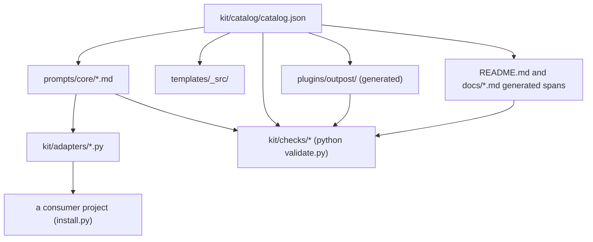

# Repository topology

Outpost is a zero-dependency Python kit. `install.py` writes prompts into a
consumer project; `validate.py` gates the kit source tree. The Claude plugin
under `plugins/outpost/` is generated from the catalog and committed.

## On-disk layout

```text
outpost/
  install.py                 # install prompts into a target project
  validate.py                # kit source-tree checks
  kit/
    catalog/                 # prompt catalog and the one version number
    adapters/                # Claude, Codex, Cursor, Copilot, Windsurf, Gemini writers
    installers/              # manifest record and settings-merge helpers
    checks/                  # structure, docs truth, catalog gates
    labels/                  # namespaced label registry (kit/labels/registry.json)
    docs_build.py            # generated README / workflow spans
    plugin.py                # generated Claude plugin tree
    templates_build.py       # generated guide templates
  prompts/                   # core + per-tool prompt overlays
  plugins/outpost/           # Claude Code plugin (skills, commands, hooks)
  templates/                 # consumer guides and overlays
  evals/                     # behavioral eval fixtures (task.txt, assertions.json) per piloted prompt
  docs/                      # onboarding, workflow, decision records, releasing
  tests/                     # pytest
  tools/                     # build helpers (plugin / docs / templates) and the behavioral eval harness (run_evals.py, eval_assertions.py)
```

## Role boundaries

- `kit/catalog/` owns prompt identity and version; do not invent parallel lists in docs.
- `kit/adapters/` owns per-tool install paths; consumer overlays stay under `prompts/<tool>/`.
- `plugins/outpost/` is generated; regenerate with `python tools/build.py plugin` instead of hand-editing skills.
- `validate.py` / `kit/checks/` prove kit truth; they do not validate a consumer install (use `--verify`).
- `docs/decisions/` is append-only decision history, checked with every other markdown file by
  the docs doctrine workflow (frontmatter and voice rules shared across the owner's repos).

## Artifact flow

The catalog drives everything else; `python validate.py` proves the generated artifacts still
match it (the arrows into "checks" below).



## Related

- [README.md](../../README.md): install, commands, supported tools.
- [docs/onboarding.md](../onboarding.md): full install path.
- [docs/workflow.md](../workflow.md): ordered prompt path and Claude shortcuts.
- [docs/releasing.md](../releasing.md): version bump and release checklist.
