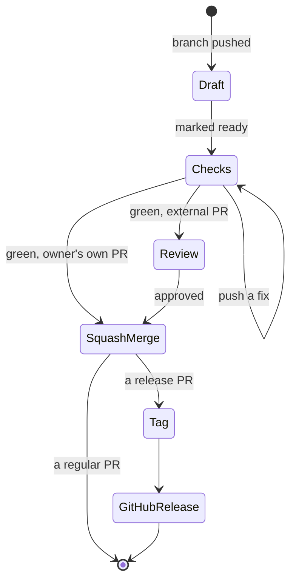

# Releasing

A clean release has one version, one changelog entry, one tag, and passing checks.

A release PR is a regular PR that keeps going: same draft-to-squash-merge path
(`docs/decisions/0001-solo-review-model.md`), then a tag and a GitHub release.

## Versioning

SemVer. One version number lives in three places that must agree:

- `kit/catalog/catalog.json` (`version`)
- `pyproject.toml` (`version`)
- `kit/__init__.py` (`KIT_VERSION`)

The `catalog` check fails if any differ, or if they do not match the latest released changelog heading. Pre-1.0, treat a minor bump as potentially breaking.

- Patch (0.0.x): a fix or doc change a caller does not notice.
- Minor (0.x.0): a new prompt, adapter, or check, added without breaking existing use.
- Major (x.0.0): a breaking change to the installer interface, the catalog shape, or a prompt contract.

## The changelog

`CHANGELOG.md` follows Keep a Changelog. Every PR that ships something user-visible adds a bullet to `[Unreleased]` under Added, Changed, Fixed, or Removed; a feature PR does not bump the version. A release PR turns the accumulated `[Unreleased]` into a dated version, so one release can carry several PRs. Never edit a released section; put a correction in a new version.

## Cutting a release

1. Confirm `python validate.py` and `pytest` pass on `main`.
2. Bump the version in `catalog.json`, `pyproject.toml`, and `kit/__init__.py` to the same value.
3. Update the ROADMAP's current-release line in `docs/ROADMAP.md` to the same value. The `roadmap` check fails while it lags the kit version.
4. Regenerate the plugin so its manifest version matches: `python tools/build.py plugin`. The `plugin_sync` check fails if the committed plugin tree no longer matches the catalog.
5. Rename `[Unreleased]` to `[X.Y.Z] - YYYY-MM-DD` and open a fresh empty `[Unreleased]` above it.
6. Run `python validate.py` and `pytest` once more over the bumped, regenerated tree.
7. Open a release PR titled `outpost vX.Y.Z: <one-line summary>`. Its body carries that version's changelog.
8. Squash-merge, so the release is one commit on `main`.
9. Tag the squash commit: `git tag -a vX.Y.Z -m "vX.Y.Z"`, then push the tag. Create the GitHub release from that tag with the version's changelog as the body. The tag and the release title are the plain `vX.Y.Z`; only the PR title carries the summary.

The first tag is v0.1.0.

## What keeps releases clean

- `main` always passes and is always releasable. Work on short-lived branches.
- One concern per PR. A human merges after the checks pass; no unattended auto-merge.
- The catalog is hand-maintained; the checks compare it with disk. Three trees are generated from it (`python tools/build.py plugin|docs|templates`), all committed and kept in sync by their own check (`plugin_sync`, `docs_sync`, `templates_sync`). Only the plugin carries the catalog's version number, so step 4 above regenerates the plugin alone; a version bump cannot change the docs or templates output.
- Stage explicit paths, never a blanket add. Keep caches and secrets out of the tree.
